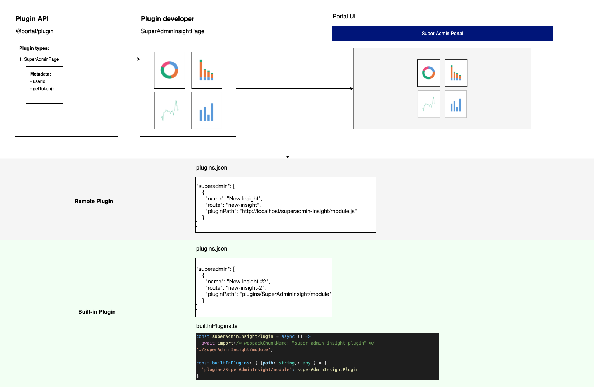

# Remote Portal Plugin



## Choose the right plugin type to be develop:

Type of plugins:

- ResearcherStudyPlugin
  sample boilerplate code: ./sample-researcher-study
- SystemAdminPagePlugin
  sample boilerplate code: Not available yet

## Steps to create remote plugin:

- Identify the type of plugin to be developed
- For below example, we will be creating researcher study plugin
- Copy sample-researcher-study folder into `apps` folder
- Rename to your new plugin name:
  1. Folder name: `sample-researcher-study`
  2. File names: -`./src/SampleResearcherStudy.tsx` -`./src/SampleResearcherStudy.scss`
  3. Rename React component name and props (`SampleResearcherStudy` and `SampleResearcherStudyProps`):
  - in `./src/SampleResearcherStudy.tsx` file
  - in `./src/module.ts` file
  4. Rename CSS class name with suffix `-plugin`:
  - `rs-plugin` in `./src/SampleResearcherStudy.tsx` file
  5. Rename the `name`, `description` in the package.json
  6. Configure the build output path for production mode in the `webpack.config.js`
- Update environment variables:
  - Add your plugin definition `REACT_APP_PLUGINS` in the `.env` and `.env.example` in `alp-ui/apps/portal` folder. E.g.
  ```
  "researcher": [
    ...,
    {
      "name": "My plugin",
      "route": "myplugin",
      "pluginPath": "https://localhost:4900/module.js",
      "featureFlag": "myplugin",
      "iconUrl": "icons/myplugin.svg",
      "iconSize": 24,
      "requiredRoles": [
        "RESEARCHER"
      ]
    }
  ]
  ```
  - Add your plugin definition `SHARED__PLUGINS_JSON` in the `.env.cs.local`, `.env.cs.remote` and `.env.cs.example`
- For test run:
  - Run plugin `yarn nx start:plugin myplugin` in `alp-ui` folder
  - Run `yarn nx start portal` in `alp-ui` folder
  - Enable feature flag in Super Admin portal -> "Tenant overview".
  - Go to Researcher portal -> "Dataset" to view the plugin.

Troubleshooting:

- Why my plugin is not showing up?
  There are some factors for the plugin to be shown as stated here:
  1.  For researcher plugin, the user must fulfilled the `requiredRoles`. E.g. If the requiredRoles is `RESEARCHER`, the logged-on user must be a researcher of the selected dataset.
  2.  Tenant feature flag must be enabled in the backend. For proxy mode, it is controlled in the admin portal.
